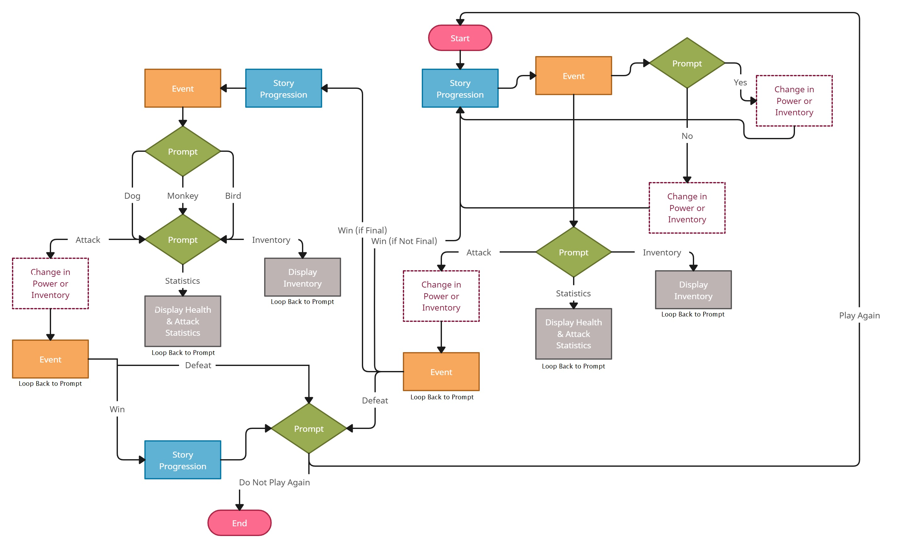
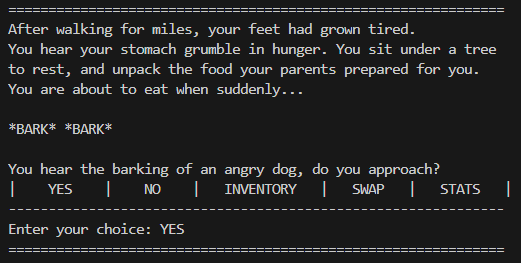
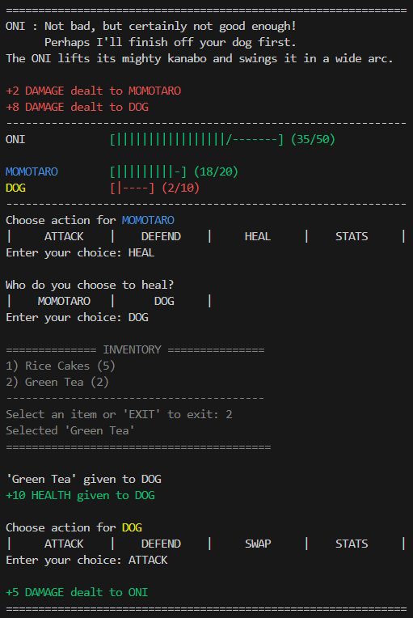
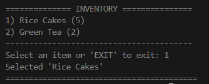
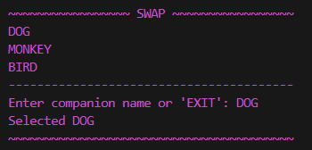
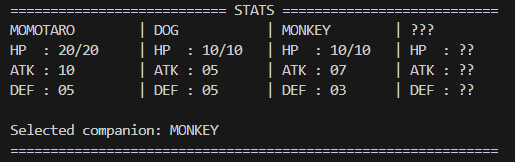

 
# Momotaro: The Fight
 
 Authors: [Jemaima Roie Ceralde](https://github.com/jaeceralde), [Alice Lai](https://github.com/AliceLaiHK), [Lindsay Phan](https://github.com/lindsayphan), & [Eunice Wang](https://github.com/ewang117)

## Project Description
_Momotaro: The Fight_ is a text-based role-playing game where the player embarks on a journey to defeat the darkness that is threatening to destroy their hometown. They play as Momotaro and are destined to meet 3 legendary animals — a dog, a monkey, and a bird — to aid them on their journey. Along the way, they will be rewarded with rice cakes and green tea to help them gather their strength. Furthermore, they will encounter onis to which they must defeat with the assistance of their legendary faunas through a series of battles. During those fights, they can switch companions after each attack to maximize their chance at survival. To win the game, the player must beat the final boss, the Demon King. There are two difficulties to choose from: normal (both rice cakes and green tea power-ups are available) and hard (just rice cakes are available), for those who like more of a challenge. 

Why is it important or interesting to you?
* The group unanimously agreed to create a role-playing game for our final project because everyone in the group likes to play games and finds joy in the wonders of storytelling. Furthermore, we wanted to see what it would be like to be on the development side of gaming instead of just playing.
 
What languages/tools/technologies do you plan to use? (This list may change over the course of the project)
* To build the RPG, we used the following:  
    - _C++_ as the language  
    - _VSCode_ to write the code  
    - _GitHub_ to store everyone’s work/contribution in one place  
    - _[creately.com](creately.com)_ to create the user navigation diagram 
    - _[diagrams.net](diagrams.net)_ to create the class diagram
    - _Google Test (gtest)_ to write unit tests for eligible functions
    - _Valgrind_ to check for memory leaks
 
What will be the input/output of your project?
* The project will ask the user/player to choose between options concerning the action they want. For example, the options might include — but are not limited to: Which companion would you like to battle alongside? What would you like to do? What items would you like to use?
Depending on the choice made by the user, the corresponding action will be taken and displayed — as well as the consequences that follow the chosen option. Additionally, the player prompts (mentioned above, although more succinctly put) will be displayed on the screen for the user to read.

What are the features that the project provides?
 
* The game has features such as three (3) different character types to choose from, multiple inventory items, two (2) difficulty levels — normal and hard, access to character health and inventory items at user’s convenience, enemies to battle along the way, a boss to defeat to finish the game, and an option to restart the game once the player reaches the end (may that be through winning or losing).
 
## User Interface Specification
### Navigation Diagram

The diagram represents the general flow of the game. Between the storytelling, the player will be prompted to select amongst the displayed options. Depending on their choice, the story will proceed accordingly. A number of loops exist in the program, as depicted in the diagram above, because there is a circular pattern linking the story (of the game) and the actions (available for a vote) together.

### Screen Layouts
The game is entirely played in the terminal and will mainly use two screens: one for the narrative/story parts and one for the combat/fighting parts. Additionally, there is an inventory, swap (companions), and stats screen. 
* Narrative: outputs a description of the current setting/story beat, then prompts the user to make a decision. 
   - Expected input: 'YES' or 'NO' to progress the story; 'INVENTORY', 'SWAP', or 'STATS' to change companion or view information. 
   
   
* Combat: outputs current health of Momotaro, companions, and enemies, then prompts user to choose an action. 
   - Expected input: 'ATTACK', 'DEFEND', 'HEAL' (only usable when selecting Momotaro's action), 'SWAP' (only usable when selecting companion's action), and 'STATS'.
   
   
* Inventory: outputs list of items (and quantity of each item), then prompts user to select one.
    - Expected input: number corresponding to item or 'EXIT'.
    
    
* Swap: outputs available companions, then prompts user to choose one.
    - Expected input: 'DOG', 'MONKEY', 'BIRD', or 'EXIT'
    
    
* Stats: outputs the current health, attack, and defense stats of Momotaro and companions.
    

## Class Diagram
 )
 Above is the UML diagram for the Momotaro: The Fight program. The program functions by creating the necessary data to display the story, characters, and the user’s choices in the terminal. For this diagram, we utilized the single responsibility principle. For example, we initially had each subclass of the Character class have a stats function, its primary task being to update and output a stats menu. However, we decided to make it its own class and its only reason to be changed is to update the health of each character. We also used the open/closed principle so that we can add another instance of character, choices, or story parts without having to change the base classes. The interface segregation principle is used as well so the client is not exposed to methods it does not need. By implementing these principles, it made our code more modular, maintainable, and extensible. It also allowed us to work more smoothly as a group when coding our individual tasks. 
 
 The Character class will hold most of the data for each character. The Bird, Dog, and Monkey classes inherit from the Character class, each having its own separate attack, and defend functions. The Momotaro and Enemy class also inherit from the Character class. The main functions of the Character class is the constructor that each inherited classes use for their constructor. The constructor takes in string name, int maxHp, int attackDamage, and int defense parameters. The attack function depletes the health of the opponent that is passed in. The other functions are get functions that return the protected variables. The Momotaro class has the actions of the main character. The defend() function takes in an int enemyHP and creates a defense attack for Momotaro to use against the opponent. This would apply to the Animal classes as well. The attack() function takes in an Enemy parameter so that when the function is called, it will take damage on the opponent. This also applies to each of the character clsses; the only difference is the attack strength being used on the enemy. There is also setAnimal() and getAnimal() functions that keeps track of the companion Momotaro chooses to help him during each battle. The StatsOutput class depends on the Animal classes (Bird, Dog, and Monkey) because whenever the animals take damage or are healed, their stats need to be updated. It also has a composition realtionship with the Character class. The Swap class is dependent on the Animal classes because in order to swap each animal out, we need to the data contained in the respective classes. 
 
 The Choices class holds the necessary data taken in from the user (the choices they make throughout the story). The question() function outputs a question that the user has to answer. The executeAnswer1() and executeAnswer2() are virtual void functions, used by the Choices(animal) classes, that carry out the user’s choice (i.e. adding something to their inventory or updating their HP). The Choices class depends on the Difficulty class because the user chooses whether or not they want to play in normal or hard mode which affects the difficulty of defeating the enemies and main boss. They also depend on the StatsOutput class because depending on the choice the user makes during the story, the health of the animal will need to be updated. The ChoicesMonkey, ChoicesDog, and ChoicesBird classes inherit from the Choices classes, each holding the choices offered and dependent storylines when the player encounters the specific animal during their journey. 
 
 The StoryParts class is an abstract class that StoryDog, StoryMonkey, and StoryBird inherit from. The Story(animal) classes hold narratives of what happens when Momotaro meets the specified animal (i.e. how they meet and any necessary dialogue). When the function printNarrative() is called, it calls on Choices(animal), through the meet(animal) variable, to further the story depending on the user choice. The Choices(animal) classes depend on the inventory classes because each choice the user makes during their encounters with the animals affects inventory classes (i.e. feeding the animal). The Choices(animal) classes also depend on the specified character class because the user will not have any access to that animal until it has joined Momotaro’s party. The Story(animal) classes depend on the designated Choices(animal) class. 

 The Narrative class holds the entire story and serves as the one place that the story componets go to. It has four main functions: beginning(), middle(), finale(), and epilogue(). Each of the functions correspond to an animal that the player meets during their journey (i.e. in the beginning, Momotaro meets the Dog and Monkey; in the middle, the Bird; in the finale, the final boss). The Narrative class depends on the Story(Animal) classes, the Battle class, and the Final Narrations class. This is due to the fact that all of these classes contain the needed story components for the entire program. The StartOver class share an aggregation relationship with the Narrative class because it deterines if the player wants to play the game again and contains instances that can be associated with the Narrative class.

 The Inventory class contains all the items the player collects during the game. The class depends on the Item class because it needs the specific item that is to be added or subtracted from the inventory. It contains the healHP() function, which takes in a string item and, depending on the item passed in, returns a specific amount of HP to be added to the player's health.

 The Battle class contains the actions taken during the battle sequences in the game. It is dependent on the AfterBattles and BattleOutput class because the Battle class holds the damage taken/dealt to each of the characters which needs to be outputed for the user to see. 
 
 > ## Final deliverable
 > All group members will give a demo to the reader during lab time. You should schedule your demo on Calendly with the same reader who took your second scrum meeting. The reader will check the demo and the project GitHub repository and ask a few questions to all the team members. 
 > Before the demo, you should do the following:
 > * Complete the sections below (i.e. Screenshots, Installation/Usage, Testing)
 > * Plan one more sprint (that you will not necessarily complete before the end of the quarter). Your In-progress and In-testing columns should be empty (you are not doing more work currently) but your TODO column should have a full sprint plan in it as you have done before. This should include any known bugs (there should be some) or new features you would like to add. These should appear as issues/cards on your Project board.
 > * Make sure your README file and Project board are up-to-date reflecting the current status of your project (e.g. any changes that you have made during the project such as changes to your class diagram). Previous versions should still be visible through your commit history. 
 
## Screenshots
 > Screenshots of the input/output after running your application
## Installation/Usage
Installing this project requires cloning a copy of this GitHub repository into an IDE of choice or just a computer's command line, as long as it supports C++ programming. Once the repository has been cloned, in the terminal/command line, type _FINISH INSTRUCTIONS!_
## Testing
This project was tested through _Google Test (gtest)_, as all developers practiced test-driven design. Unfortunately, not all classes/functions that exist within this program were eligible for such tests — specifically those that were meant to output in the terminal since this is, after all, a terminal-based RPG. Thus, to test the functionality of output calls, the program was run in the terminal countless times throughout the entire production, and we manually verified that the output was correct. Furthermore, _Valgrind_ was utilized to eliminate potential memory leaks.
